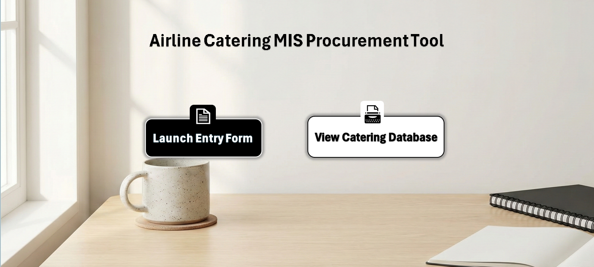
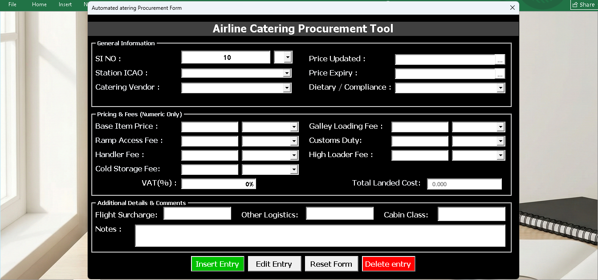
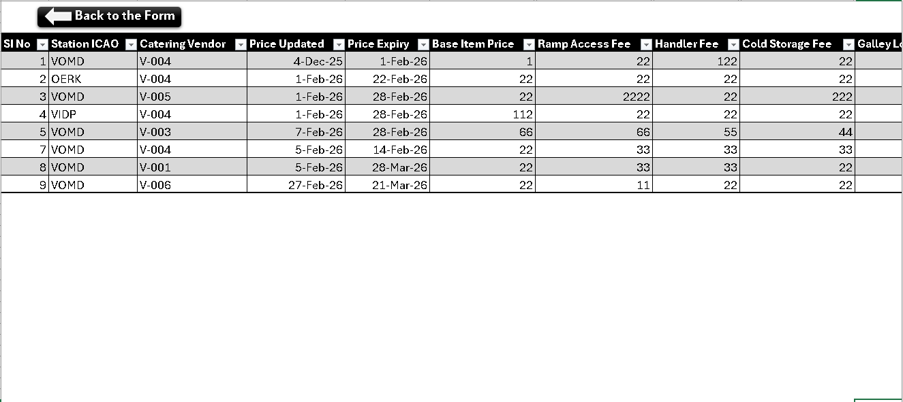
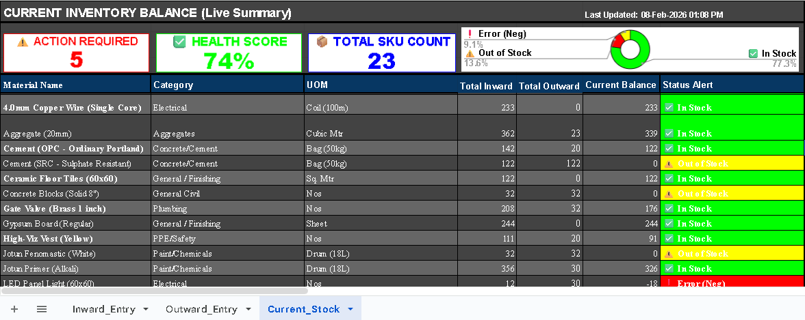

# Basil Thalakkodan

✉️ [BasilThalakkodan@gmail.com](mailto:BasilThalakkodan@gmail.com) · 📞 +91 94604 8605 · 🔗 [linkedin.com/in/BasilThalakkodan](https://www.linkedin.com/in/BasilThalakkodan)

---

## 🌟 About Me  
Detail-oriented **Data Analyst** experienced with Excel, SQL, Power BI and Tableau. I specialise in data cleaning, transformation, dashboard building and workflow automation. I enjoy converting raw datasets into meaningful insights that support better decision-making. 🚀

---

## 🎓 Education  
- **Bachelor of Business Administration (BBA) — Aviation & Logistics**  
  *Bangalore North University, Bangalore* · **CGPA: 8.75**

---

## 💼 Work Experience  

### 🔹 Data Analyst Intern — *Rows & Columns* · Calicut, Kerala  
- Performed end-to-end data preparation using Excel, SQL, Power BI and Tableau.  
- Streamlined reporting workflows with automation and reusable templates.  
- Delivered insight-driven dashboard presentations.

### 🔹 Operations Intern — *Akbar Travels Of India Pvt Ltd* · Manjeri, Kerala  
- Supported daily operations and customer case handling.  
- Ensured accuracy while managing operational data.  
- Used Google Sheets and Excel to maintain structured datasets.

---

## 🧩 Projects  
### 🔹 Healthcare Operations & Revenue Intelligence — *Power BI + DAX*
🔗 **[Live Project / Video Walkthrough](https://www.linkedin.com/posts/basilthalakkodan_dataanalytics-powerbi-healthcareanalytics-activity-7436737555972128768-Mbfy?utm_source=share&utm_medium=member_desktop&rcm=ACoAAEOjHF0BiX2fWLr1ioMy2Q4ZhMRJPZSYeNo)**

-Developed a multi-page executive dashboard to monitor hospital operations, patient flow, and financial health.
-Engineered complex DAX measures to track Revenue Cycle Management (RCM) KPIs, including Gross Revenue, Net Revenue, and Revenue Leakage.
-Integrated regional healthcare KPIs, including Malaffi Compliance and Patient Satisfaction scores, to provide holistic facility performance insights.
-Optimized dashboard UI/UX with an application-style interface, featuring a synchronized slicer panel and geographic mapping for regional performance analysis.

#### 📸 Dashboard Preview  

  

---
### 🔹 Airline Catering MIS Procurement Tool — *Advanced Excel + VBA* 
🔗 **[Live Project / Video Walkthrough](https://www.linkedin.com/posts/basilthalakkodan_dataanalytics-mis-aviation-activity-7432302766074658816-vzNp?utm_source=share&utm_medium=member_desktop&rcm=ACoAAEOjHF0BiX2fWLr1ioMy2Q4ZhMRJPZSYeNo)**

- Built an automated procurement database to standardize global aviation vendor pricing and eliminate manual entry errors.  
- Engineered dynamic VBA algorithms to instantly convert multi-regional currencies into a unified USD/KG landed cost and calculate complex logistics fees.  
- Structured a clean, relational backend database optimized for downstream analysis and dashboard reporting.

#### 📸 Dashboard Preview  

---
### 🔹 GCC Construction Material Inventory System (IMS) — *Google Sheets + Google Apps Script*  
🔗 **[Live Project / Video Walkthrough](https://www.linkedin.com/posts/basilthalakkodan_vision2030-vision2030-saudiarabia-activity-7427256386667028480-RwJg?utm_source=share&utm_medium=member_desktop&rcm=ACoAAEOjHF0BiX2fWLr1ioMy2Q4ZhMRJPZSYeNo)**

- Built a full-stack inventory application to digitize the material lifecycle for Middle Eastern construction logistics.  
- Developed an Outward Form to manage site allocations and track warehouse control.  
- Analysed stock levels via a live executive dashboard featuring health scores and automated alerts.

#### 📸 Dashboard Preview  

---

### 🔹 Sales Performance Dashboard — *SQL + Tableau*  
🔗 **[Live Project / Video Walkthrough](https://www.linkedin.com/posts/basilthalakkodan_tableau-sql-datavisualization-activity-7399470068897599489-phXv?utm_source=share&utm_medium=member_desktop&rcm=ACoAAEOjHF0BiX2fWLr1ioMy2Q4ZhMRJPZSYeNo)**

- Built a sales analytics dashboard using SQL and Tableau.  
- Identified key product and customer insights.  
- Analysed sales and profit trends with clear KPI visuals.

#### 📸 Dashboard Preview  
  

---

### 🔹 HR Analytics Dashboard — *MySQL + Power BI*  
🔗 **[Detailed Project Walkthrough](https://www.linkedin.com/posts/basilthalakkodan_hr-analytical-dashboard-activity-7391679478734802944-meAe?utm_source=share&utm_medium=member_desktop&rcm=ACoAAEOjHF0BiX2fWLr1ioMy2Q4ZhMRJPZSYeNo)**

- Analysed organisation-wide employee data.  
- Identified diversity gaps and attrition patterns.  
- Created a consolidated HR dashboard for insights
  
#### 📸 Dashboard Preview  
  

.

---

### 🔹 Logistics Performance Dashboard — *Power BI + AI Analytics*  
🔗 **[Detailed Project Walkthrough](https://www.linkedin.com/posts/basilthalakkodan_microsoftai-powerbi-logisticsanalytics-activity-7382737877819908096-_VMo?utm_source=share&utm_medium=member_desktop&rcm=ACoAAEOjHF0BiX2fWLr1ioMy2Q4ZhMRJPZSYeNo)**

- Built a logistics performance dashboard.  
- Identified operational delays and delivery patterns.  
- Used AI-based anomaly detection for better insight.
  
#### 📸 Dashboard Preview 
  
  

---

## 🎯 Interests  
Here are a few things I enjoy:  

- 📊 **Dashboard Design**  
- 📈 **Data Analysis**  
- ✈️ **Travelling**  
- 📚 **Reading**

---

## 🧠 Tools & Skills  

  
  
  
  

---

## 🤝 Connect  
## 📫 Contact Details  
*Let’s connect and explore opportunities together!*  

<table>
  <tbody>
    <tr>
      <td>📧</td>
      <td><a href="mailto:Basilthalakkodan@gmail.com">Basilthalakkodan@gmail.com</a></td>
    </tr>
    <tr>
      <td>📞</td>
      <td>(+91) 994-604-8605</td>
    </tr>
    <tr>
      <td>📍</td>
      <td>Kerala, India</td>
    </tr>
    <tr>
      <td>⬇️</td>
      <td><a href="Business Analyst.pdf">Download My CV</a></td>
    </tr>
    <tr>
      <td>🌐</td>
      <td><a href="https://www.linkedin.com/in/basil-thalakkodan">Connect on LinkedIn</a></td>
    </tr>
  </tbody>
</table>
